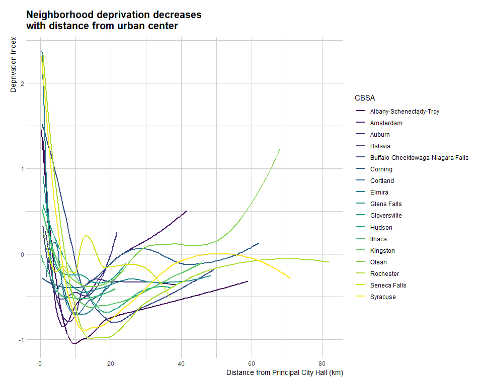

Distance profiles help explore the demographic characteristics of an urban area. They have been widely used in urban demography and sociology research. Dating back to the 1920s and the [Chicago School](https://en.wikipedia.org/wiki/Chicago_school_(sociology)) models. They posit that every major city expands in [concentric circles](https://transportgeography.org/?page_id=4908) from the urban center.

I came across this paper, [*A Reproducible Framework for Visualizing Demographic Distance Profiles in US Metropolitan Areas*](https://link.springer.com/article/10.1007/s40980-018-0042-7), that walks you through a workflow for creating distance profiles in R. I found it interesting, and was familiar with the packages needed, so, I decided to create distance profiles of [neighborhood deprivation](https://towardsdatascience.com/a-census-based-deprivation-index-using-r-7aa738da697c) in New York State.  

## Data Prep

There is quite a bit of prep work before being able to calculate distances. I won't show the code here, but it is all posted in [GitHub](https://github.com/iecastro/NYS_CBSA). In short:

1. I first had to get spatial files for NYS, NY census tracts, and US metros. 
2. Filter NY metros
3. Create deprivation index and join to census tracts
4. Do a spatial filter of census-tracts within NY metros

So far, I've been referring to *metros* interchangeably. Really, there are distinctions between metropolitan and micropolitan areas. There are also definitions for core-based statistical areas (CBSA) which refers to a metro- OR micro- area, and combine statistical areas (CSA) which refers to a metro- AND micro- area. There are also primary statistical areas (PSA), which are all the CSAs plus the CBSAs that are not part of a CSA. It's a headache, really. Also, the [federal statistical system](https://en.wikipedia.org/wiki/Federal_Statistical_System_of_the_United_States) creates products and collects data for these geographies, yet, somehow, these definitions are created by the White House's [budget office](https://www.whitehouse.gov/sites/whitehouse.gov/files/omb/bulletins/2017/b-17-01.pdf).

Anyways, I've digressed. So, after filtering and joining the data, I can plot levels of deprivation across CBSAs in NYS. (This map is not inclusive of all CBSAs in NY)

## Distance Profiles

You can see how each urban core stands out (bright colors = high deprivation) from the rest of the state. It does resemble the concentric rings model, where, in this case, levels of deprivation are highest at the core, and diminish with distance. The same is true for really affluent neighborhoods (census-tracts). The index is relative to the entire state. So, urban cores have areas of high deprivation and affluence compared to all census tracts in the state, not just their respective CBSA. 

However, to create distance profiles, we need to measure distance. To do this, I had to look up coordinates for the principal City (or Town) hall of each CBSA. This was a bit time consuming, but, Google helped. So not as daunting as it sounds. Once all the coordinates were collected, they had to be converted to [simple features and projected](https://cran.r-project.org/web/packages/sf/vignettes/sf1.html#coordinate-reference-system) ... cuz, you know, the earth is round.

Distance was measured from each principal city hall to the census-tract centroids. The reference article provides some detailed code to accomplish this. The Albany and Buffalo CBSAs, both had multiple principal cities, so, coordinates were plotted for each and distance was measured from the nearest one. 

This data is showing us a really interesting dynamic. Deprivation is really high close to center (inner city), and sharply drops (inner suburbs); then about 10 km from the center, deprivation starts increasing again, but, does not reach levels seen at the urban core.

I wanted to further explore this data, so I narrowed my focus to the four major Upstate areas (of course, everything I just wrote after *four* is highly subjective and arbitrary). [What is Upstate New York?](https://www.washingtonpost.com/news/the-fix/wp/2016/04/19/so-what-is-upstate-new-york-exactly/?utm_term=.744abe9b3fe3).

## Upstate New York

To explore further patterns, I plot how distance relates to deprivation in each county, within a CBSA. In the Albany and Buffalo areas, which have several principal cities, the relationship is pretty straightforward -- deprivation decreases with distance from city hall. In the Syracuse and Rochester CBSAs, however, we see a pattern where census-tracts in the principal counties (Onondaga and Monroe, respectively) are represented across the range of deprivation scores, whereas census-tracts in the commuting counties do not reach those same high levels of deprivation or affluence. 

To make this more intuitive, I classify each county (across the four CBSAs) as either *Core* or *Commuting* and transform deprivation scores into quartiles. By doing this, it is clear that the most deprived census-tracts in a CBSA are those closest and farthest from the core. This makes sense, those tracts farther out in commuting counties tend to be very rural, whereas, the closer commuting tracts are developed, because they are adjacent to the core county.

## What now?

I don't know, as promised, this is all just exploratory. I think there is potential to use these methods in health research, to highlight disparities or evaluate access to care, but the right data are needed. If you found this interesting, I suggest reading the [reference article](https://link.springer.com/article/10.1007/s40980-018-0042-7#Sec7). 

Thanks for reading!
